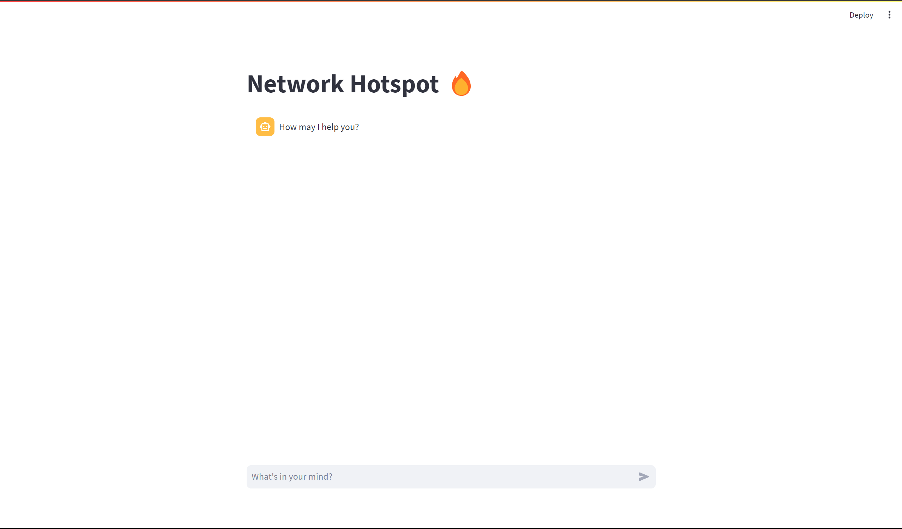

<!-- PROJECT LOGO -->
 

  <h2 align="center">Identification of Potential Hotspots In Network Infrastructure</h2>

  

    Provides resolutions to network hotspot scenarios
  

<!-- TABLE OF CONTENTS -->

  
Table of Contents

  <ol>
    <li>
      <a href="#about-the-project">About The Project</a>
      <ul>
        <li><a href="#built-with">Built With</a></li>
      </ul>
    </li>
    <li>
      <a href="#getting-started">Getting Started</a>
      <ul>
        <li><a href="#prerequisites">Prerequisites</a></li>
        <li><a href="#installation">Installation</a></li>
      </ul>
    </li>
    <li><a href="#usage">Usage</a></li>
    <li><a href="#roadmap">Roadmap</a></li>
    <li><a href="#contributing">Contributing</a></li>
    <li><a href="#license">License</a></li>
    <li><a href="#contact">Contact</a></li>
    <li><a href="#acknowledgments">Acknowledgments</a></li>
  </ol>

<!-- ABOUT THE PROJECT -->
## About The Project

This application is a platform that can automatically identify the most appropriate resolution for a given hotspot. This solution should leverage historical data and frequency of resolutions to determine the best course of action.

(<a href="#readme-top">back to top</a>)

### Built With

Tools we used:

* Python
* Streamlit
* Scikit-Learn
* ChatGPT
* Google Colab

(<a href="#readme-top">back to top</a>)

<!-- GETTING STARTED -->
## Getting Started
- [x] Train Model
- [x] Build a ChatBot Interface
- [ ] Integrate LLM
- [ ] Integrate NLP Techniques and RNN

(<a href="#readme-top">back to top</a>)

## DEMO

